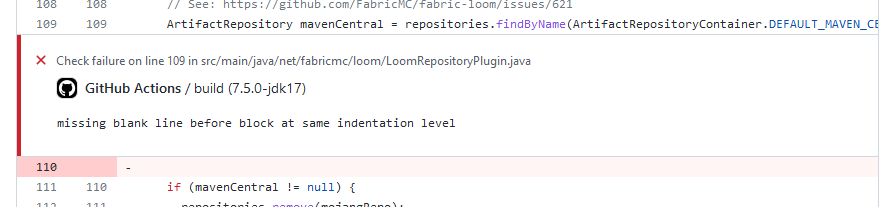

# Publish Checkstyle Report


An action that displays [Checkstyle](https://checkstyle.org/) errors as inline code annotations.



## Usage

After the workflow step that runs Checkstyle and produces the report XML files, add this action:

```yaml
- name: Publish Checkstyle report
  uses: Juuxel/publish-checkstyle-report@v2
  if: ${{ failure() || success() }}
  with:
    # required: The glob paths to report XML files as a multiline string
    # The format below works for the Gradle Checkstyle plugin with default configurations
    reports: |
      build/reports/checkstyle/*.xml
```

> You can replace `failure() || success()` with just `failure()` if you only want the annotations to appear
> when the build has failed.
